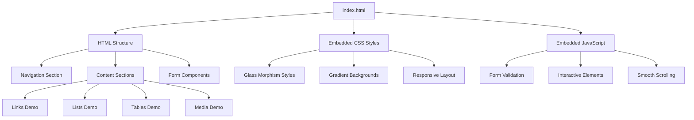
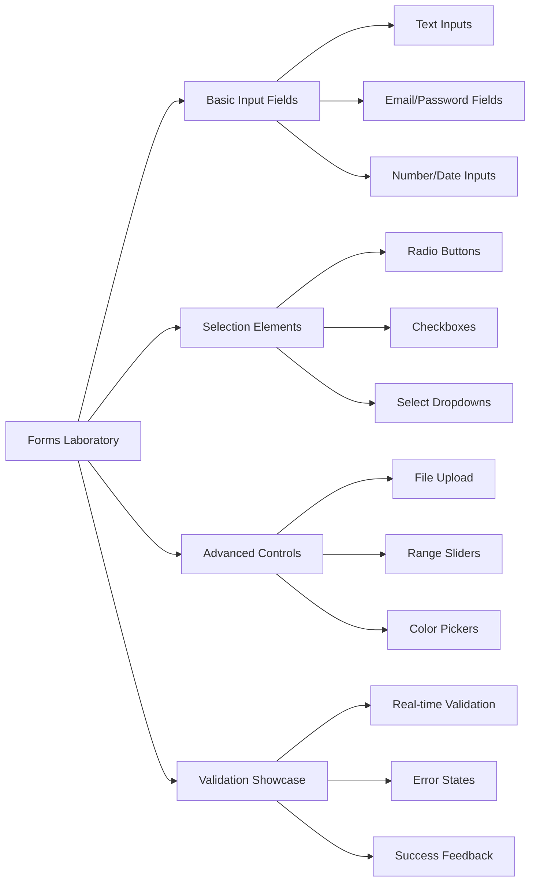
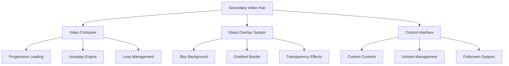

# HTML Form Exploration - Single Page Application Design

## Overview

This design document outlines the creation of a comprehensive single-page HTML application that showcases all types of HTML formatting, custom styling, and form elements. The application will serve as an interactive exploration of HTML capabilities with modern glassmorphism and gradient styling approaches.

**Project Type**: Frontend Single Page Application  
**Target Audience**: Developers learning HTML/CSS/JavaScript fundamentals  
**Deployment**: Single HTML file with embedded CSS and JavaScript

## Architecture

### Single File Structure
The application follows a monolithic single-file architecture where all components are contained within a single `index.html` file:

### Visual Design System

#### Color Palette Strategy

**Primary Cyberpunk Palette**
| Color Name | Hex Value | RGB Value | Usage Context |
|------------|-----------|-----------|---------------|
| Neon Purple | #8a2be2 | rgb(138, 43, 226) | Primary accent, CTAs, focus states |
| Electric Blue | #00ffff | rgb(0, 255, 255) | Secondary accent, links, highlights |
| Plasma Pink | #ff1493 | rgb(255, 20, 147) | Error states, warning indicators |
| Cyber Green | #39ff14 | rgb(57, 255, 20) | Success states, validation feedback |
| Deep Space | #0a0a0a | rgb(10, 10, 10) | Base background, deep containers |
| Void Black | #000000 | rgb(0, 0, 0) | Text shadows, depth creation |

**Glass Morphism Transparency Levels**
| Transparency Level | Alpha Value | Application |
|-------------------|-------------|-------------|
| Subtle Glass | rgba(255,255,255,0.05) | Background overlays |
| Standard Glass | rgba(255,255,255,0.1) | Card backgrounds |
| Prominent Glass | rgba(255,255,255,0.15) | Active elements |
| Intense Glass | rgba(255,255,255,0.2) | Hover states |
| Maximum Glass | rgba(255,255,255,0.25) | Focus states |

**Gradient Collection Library**
| Gradient Name | CSS Definition | Visual Effect |
|---------------|----------------|---------------|
| Cosmic Nebula | linear-gradient(135deg, #667eea 0%, #764ba2 100%) | Background depth |
| Electric Storm | linear-gradient(45deg, #8a2be2 0%, #00ffff 50%, #ff1493 100%) | Interactive elements |
| Cyber Matrix | radial-gradient(circle at center, #39ff14 0%, #0a0a0a 70%) | Focus indicators |
| Plasma Wave | linear-gradient(90deg, #ff1493 0%, #8a2be2 50%, #00ffff 100%) | Progress bars |
| Deep Space Flow | linear-gradient(180deg, #0a0a0a 0%, #1a1a2e 50%, #16213e 100%) | Page background |
| Holographic Shift | conic-gradient(from 0deg, #8a2be2, #00ffff, #39ff14, #ff1493, #8a2be2) | Special effects |

#### Advanced Gradient Design Patterns

**Background Gradient Architecture**
- **Primary Viewport**: Animated cosmic nebula with slow rotation effect
- **Section Dividers**: Plasma wave gradients with opacity transitions
- **Card Containers**: Multi-layer gradient stacking with glass overlay
- **Interactive Zones**: Electric storm gradients with intensity variations

**Dynamic Gradient Behaviors**
| Element Type | Base Gradient | Hover Gradient | Active Gradient | Transition Duration |
|--------------|---------------|----------------|-----------------|--------------------|
| Navigation Items | Subtle Glass | Electric Storm | Plasma Wave | 0.3s ease-in-out |
| Form Fields | Deep Space Flow | Cyber Matrix | Holographic Shift | 0.2s ease |
| Buttons | Cosmic Nebula | Electric Storm | Plasma Wave | 0.25s ease-in-out |
| Cards | Glass Overlay | Prominent Glass | Maximum Glass | 0.4s ease |
| Progress Bars | Static Base | Animated Plasma Wave | Pulsing Cyber Matrix | 0.5s ease-in-out |

#### Advanced Glass Morphism Implementation Strategy

**Backdrop Filter Specifications**
| Effect Level | Blur Intensity | Brightness | Contrast | Saturation |
|--------------|----------------|------------|----------|-----------|
| Subtle | blur(5px) | brightness(1.1) | contrast(0.9) | saturate(1.2) |
| Standard | blur(10px) | brightness(1.2) | contrast(0.8) | saturate(1.3) |
| Prominent | blur(15px) | brightness(1.3) | contrast(0.7) | saturate(1.4) |
| Intense | blur(20px) | brightness(1.4) | contrast(0.6) | saturate(1.5) |
| Maximum | blur(25px) | brightness(1.5) | contrast(0.5) | saturate(1.6) |

**Advanced Border Styling Matrix**
| Border Type | Width | Style | Color Strategy | Visual Purpose |
|-------------|-------|-------|----------------|----------------|
| Ethereal Edge | 1px | solid | Linear gradient border-image | Subtle definition |
| Plasma Rim | 2px | solid | Animated gradient border | Active elements |
| Holographic Frame | 3px | double | Multi-color shifting gradient | Premium features |
| Cyber Outline | 1px | dashed | Electric blue with opacity | Technical elements |
| Neon Glow | 2px | solid | Box-shadow with gradient colors | Call-to-action items |

**Multi-Layer Shadow Architecture**
| Shadow Layer | Offset X | Offset Y | Blur Radius | Spread | Color | Opacity |
|--------------|----------|----------|-------------|--------|-------|----------|
| Base Depth | 0px | 2px | 8px | 0px | #000000 | 0.3 |
| Mid Elevation | 0px | 4px | 16px | 0px | #8a2be2 | 0.2 |
| High Float | 0px | 8px | 32px | 0px | #00ffff | 0.1 |
| Glow Effect | 0px | 0px | 20px | 2px | Current accent color | 0.4 |
| Inner Highlight | inset 0px | 1px | 2px | 0px | #ffffff | 0.2 |

## Featured Widget Gallery

### Premium Interactive Components

#### 1. Holographic Navigation Pills
**Design Specification**: Floating navigation elements with dynamic holographic effects

| Feature | Implementation | Visual Behavior |
|---------|----------------|------------------|
| Base State | Glass morphism with subtle glow | Soft plasma rim with 15px blur |
| Hover State | Intensified holographic border | Animated gradient shift with scale(1.05) |
| Active State | Full neon activation | Pulsing cyber matrix with enhanced shadows |
| Transition | Multi-phase animation | 0.3s ease-in-out with stagger effects |

#### 2. Cyberpunk Data Cards
**Design Specification**: Information display cards with advanced glass styling

| Card Type | Background Treatment | Interactive Features |
|-----------|---------------------|----------------------|
| Basic Info Card | Subtle glass with cosmic nebula | Hover reveals additional data layers |
| Premium Feature Card | Prominent glass with electric storm | Click expands with holographic animation |
| Success Indicator Card | Cyber green accent with glow | Pulsing validation feedback |
| Warning Alert Card | Plasma pink gradient with urgency | Animated attention-drawing effects |

#### 3. Quantum Progress Indicators
**Design Specification**: Advanced progress visualization with particle effects

| Progress Type | Visual Style | Animation Pattern |
|---------------|--------------|-------------------|
| Linear Progress | Plasma wave gradient fill | Left-to-right gradient animation |
| Circular Progress | Holographic ring with particles | Rotating gradient with spark effects |
| Multi-step Progress | Connected cyber nodes | Sequential activation with glow trails |
| Loading Spinner | Rotating holographic elements | Continuous spin with opacity variations |

#### 4. Ethereal Input Fields
**Design Specification**: Form inputs with floating label and glass styling

| Input State | Visual Treatment | Interaction Feedback |
|-------------|------------------|----------------------|
| Default | Subtle glass background | Soft inner glow on focus |
| Focused | Enhanced glass with cyber matrix | Floating label animation |
| Valid | Cyber green accent border | Success particle effects |
| Invalid | Plasma pink error styling | Shake animation with error glow |
| Disabled | Reduced opacity glass | Muted gradient overlay |

#### 5. Neon Button Collection
**Design Specification**: Interactive buttons with cyberpunk aesthetics

| Button Variant | Base Styling | Hover Effects | Active State |
|----------------|--------------|---------------|---------------|
| Primary Action | Electric storm gradient | Scale + glow intensification | Plasma wave animation |
| Secondary Action | Cosmic nebula background | Glass enhancement | Subtle pulse effect |
| Danger Action | Plasma pink gradient | Warning glow expansion | Urgent pulse pattern |
| Success Action | Cyber green accent | Validation glow | Success confirmation |
| Ghost Button | Transparent with neon border | Fill animation | Full activation |

#### 6. Holographic Table Elements
**Design Specification**: Data tables with cyberpunk visual enhancements

| Table Component | Styling Approach | Interactive Behavior |
|-----------------|------------------|----------------------|
| Table Headers | Glass with gradient borders | Sortable with cyber indicators |
| Data Rows | Alternating glass opacity | Hover highlights with glow |
| Action Cells | Neon button integration | Contextual action animations |
| Pagination | Holographic page indicators | Smooth transition effects |

#### 7. Cyber Media Containers
**Design Specification**: Media display with futuristic framing

| Media Type | Container Style | Enhancement Features |
|------------|----------------|----------------------|
| Image Gallery | Glass frames with neon accents | Lightbox with blur background |
| Video Player | Holographic control overlay | Custom cyberpunk controls |
| Audio Visualizer | Reactive gradient visualization | Real-time frequency display |
| File Preview | Glass document cards | Type-specific cyber icons |

### Advanced Widget Behaviors

#### Micro-Interaction Specifications

| Interaction Type | Trigger | Animation Sequence | Duration |
|------------------|---------|--------------------|-----------|
| Glass Ripple Effect | Click/Tap | Expanding circular wave with gradient | 0.6s |
| Holographic Reveal | Hover | Gradient shift with opacity fade-in | 0.4s |
| Cyber Pulse | Focus | Rhythmic glow intensity variation | 1.2s loop |
| Particle Burst | Success Action | Scattered light particles | 0.8s |
| Glitch Effect | Error State | Brief visual distortion | 0.2s |
| Neon Trail | Drag/Swipe | Following gradient trail | Real-time |

#### Responsive Widget Adaptations

| Screen Size | Widget Scaling | Effect Intensity | Performance Mode |
|-------------|----------------|------------------|------------------|
| Desktop (1200px+) | 100% scale | Full effects | High performance |
| Laptop (992px-1199px) | 95% scale | Standard effects | Balanced mode |
| Tablet (768px-991px) | 90% scale | Reduced blur | Optimized mode |
| Mobile (576px-767px) | 85% scale | Minimal effects | Battery-saving |
| Small Mobile (<576px) | 80% scale | Essential only | Performance priority |

## Component Architecture

### Enhanced Navigation System
**Component Purpose**: Immersive cyberpunk navigation with holographic effects

| Navigation Element | Visual Design | Interaction Pattern | Accessibility |
|-------------------|---------------|---------------------|---------------|
| Main Nav Pills | Holographic glass with electric rim | Hover reveals subsection previews | ARIA labels with cyber voice |
| Section Anchors | Floating cyber nodes | Magnetic hover attraction | Keyboard navigation support |
| Progress Tracker | Quantum progress visualization | Real-time completion indicators | Screen reader announcements |
| Quick Actions | Neon-rimmed glass buttons | Contextual action revelation | Focus trap management |
| Theme Switcher | Rotating holographic selector | Smooth theme transition | Color contrast compliance |

### Content Section Definitions

#### 1. Advanced Clickable Links Demonstration
**Purpose**: Showcase hyperlink artistry with cyberpunk aesthetics

| Link Category | Visual Treatment | Hover Mechanics | Click Feedback |
|---------------|------------------|-----------------|----------------|
| Hypertext Links | Neon underline with gradient flow | Electric current animation | Ripple effect with trail |
| Email Contacts | Holographic envelope icon | 3D flip reveal animation | Cyber confirmation pulse |
| Phone Numbers | Glowing communication symbol | Pulsing signal visualization | Connection establishment effect |
| File Downloads | Progress-aware download indicator | Completion percentage display | Success particle burst |
| External Links | Portal-style transition hint | Dimensional gateway animation | Reality-shift confirmation |
| Anchor Links | Quantum teleportation effect | Smooth scroll with particle trail | Destination highlight glow |
| Social Media | Platform-specific cyber styling | Brand color integration | Share confirmation |
| Documentation | Knowledge crystal visualization | Information flow animation | Learning achievement unlock |

#### 2. Advanced HTML Lists Structure Exploration
**Purpose**: Transform lists into cyberpunk data structures

| List Architecture | Cyber Styling | Visual Hierarchy | Interactive Features |
|-------------------|---------------|------------------|----------------------|
| Unordered Lists | Holographic bullet points | Neon gradient connectors | Expandable sub-items |
| Ordered Lists | Cyber numerical indicators | Sequential glow activation | Progress visualization |
| Definition Lists | Knowledge crystal pairs | Term-definition relationships | Hover detail expansion |
| Nested Hierarchies | Multi-level cyber trees | Depth-based opacity | Collapsible branches |
| Task Lists | Interactive cyber checkboxes | Completion animations | Progress tracking |
| Tag Clouds | Floating keyword bubbles | Size-based importance | Clustering animations |
| Timeline Lists | Chronological cyber markers | Event flow visualization | Interactive milestones |
| Category Lists | Grouped cyber containers | Section-based styling | Filter capabilities |

#### 3. Cyberpunk Tables Gallery
**Purpose**: Data visualization with holographic table enhancements

| Table Feature | Cyber Implementation | Visual Enhancement | User Experience |
|---------------|---------------------|--------------------|-----------------|
| Data Grids | Glass cell containers | Alternating row gradients | Smooth scrolling |
| Sortable Headers | Holographic sort indicators | Animated column reorganization | Click feedback |
| Filterable Columns | Cyber filter overlays | Real-time data highlighting | Search integration |
| Responsive Tables | Adaptive glass breakpoints | Mobile-optimized layouts | Touch gestures |
| Interactive Cells | Editable cyber inputs | In-place editing capabilities | Validation feedback |
| Data Visualization | Embedded gradient charts | Progress bar integrations | Hover statistics |
| Export Functions | Cyber download portals | Format selection interface | Progress indicators |
| Pagination Controls | Quantum page navigation | Smooth transition effects | Infinite scroll option |

## Media Integration Architecture

### Primary Video Assets
- **Hero Background Video**: `Hailuo_Video_A cyberpunk shinobi, wreathed _425441435662598147.mp4`
  - Seamless loop as main page background with glassmorphism overlay
  - Dynamic shinobi warrior in cyberpunk atmosphere
  - Performance-optimized looping with fade transitions
- **Interactive Video Player**: Custom neon-styled controls with holographic interface
- **Picture-in-Picture Support**: Floating video widgets with cyber frames

### Complete Image Asset Gallery
- **Primary Cyberpunk Artwork**: `1365733-cyberpunk-scifi-neon-artist-artwork-digital-art.jpg`
  - Ultra high-resolution (4149.5KB) cyberpunk cityscape masterpiece
  - Featured hero section background with neon urban landscape
  - Multi-layer parallax scrolling integration
- **Cyberpunk Character Portrait 1**: `pngtree-cyberpunk-game-movie-character-portrait-modeling-png-image_9015365.png`
  - High-detail character model (472.6KB) for avatar systems
  - Transparent PNG for overlay effects and profile sections
  - Interactive testimonial component integration
- **Cyberpunk Character Portrait 2**: `pngtree-cyberpunk-movie-game-character-portrait-modeling-png-image_9015364.png`
  - Secondary character design (356.9KB) for user selection
  - Form validation feedback and interactive elements
  - Character-based navigation system
- **Atmospheric Background**: `thumb-1920-1033872.jpg`
  - Optimized section divider background (352.6KB)
  - Parallax scrolling effect integration
  - Card background and ambient lighting source
- **Design Accent Element**: `fla750ad750x1000f8f8f8.png`
  - Specialized UI component (114.4KB) for decorative enhancements
  - Button backgrounds and form field styling
  - Holographic effect overlays

### Asset-Driven Interactive Features

**Character-Based Navigation System**
| Character Asset | Navigation Role | Interactive Behavior | Visual Enhancement |
|----------------|-----------------|----------------------|--------------------|
| Character Portrait 1 | Primary avatar selector | Hover reveals character stats | Holographic frame animation |
| Character Portrait 2 | Secondary theme switcher | Click changes UI personality | Morphing glass effects |
| Shinobi Video | Background atmosphere | Mouse parallax response | Dynamic overlay intensity |
| Cityscape Image | Section divider | Scroll-triggered reveals | Parallax depth layers |
| Design Elements | UI enhancement accents | Interactive micro-animations | Floating decoration system |

**Asset Performance Optimization**
| Asset Type | File Size | Loading Strategy | Optimization Technique |
|------------|-----------|------------------|------------------------|
| Shinobi Video | 2056.0KB | Progressive streaming | Compressed preview loop |
| Cyberpunk Art | 4149.5KB | Lazy load with placeholder | WebP conversion fallback |
| Character PNG 1 | 472.6KB | Preload for interactions | Sprite sheet optimization |
| Character PNG 2 | 356.9KB | On-demand loading | Alpha channel compression |
| Background Image | 352.6KB | Intersection Observer | Progressive JPEG |
| Design Element | 114.4KB | Inline embedding | SVG conversion option |

**Cross-Asset Visual Harmony**
| Integration Strategy | Visual Coherence | Performance Impact | User Experience |
|----------------------|------------------|--------------------|-----------------|
| Color Palette Extraction | Auto-extract dominant colors from assets | Low | Unified theming |
| Character Theme Switching | Dynamic UI adaptation based on selected character | Medium | Personalized experience |
| Video-Driven Ambiance | Background video influences section styling | High | Immersive atmosphere |
| Asset-Based Transitions | Image content drives animation patterns | Medium | Contextual interactions |
| Unified Cyberpunk Aesthetic | All assets contribute to cohesive visual story | Low | Brand consistency |

### Forms Laboratory Architecture

#### Form Collection Strategy
The forms section serves as the comprehensive demonstration of all HTML form elements with advanced glass morphism styling.

#### Form Element Specifications

| Form Element | Glass Styling Approach | Validation Strategy |
|--------------|----------------------|-------------------|
| Text Input Fields | Transparent background with gradient borders | Real-time character count |
| Email Input | Glass envelope icon with validation indicator | Format verification with visual feedback |
| Password Input | Glass security styling with strength meter | Dynamic strength visualization |
| Radio Button Groups | Glass circle selections with gradient highlights | Exclusive selection animation |
| Checkbox Collections | Glass square styling with gradient check marks | Multiple selection management |
| Select Dropdowns | Glass dropdown with blur background | Custom option styling |
| File Upload Zones | Glass drag-drop area with gradient progress | Visual upload feedback |
| Range Sliders | Glass track with gradient thumb styling | Real-time value display |
| Color Picker | Glass palette with gradient preview | Live color demonstration |
| Submit Buttons | Primary glass button with gradient animation | Loading state transitions |

#### Validation System Design

| Validation Type | Visual Feedback | User Experience |
|----------------|-----------------|-----------------|
| Required Field Validation | Red gradient border with glass error message | Immediate feedback on blur |
| Format Validation | Color-coded borders with glass success/error icons | Progressive validation states |
| Real-time Validation | Live feedback with glass overlay messages | Non-intrusive guidance |
| Form Submission | Glass loading overlay with gradient progress | Success confirmation modal |

### Ultimate Forms Laboratory Architecture

#### Comprehensive Form Collection Strategy
The forms section represents the pinnacle of HTML form element demonstration, featuring cutting-edge cyberpunk styling with advanced glass morphism and interactive behaviors.

```mermaid
graph TB
    A[Ultimate Forms Lab] --> B[Basic Input Arsenal]
    A --> C[Selection Matrix]
    A --> D[Advanced Control Hub]
    A --> E[Validation Engine]
    A --> F[Submission Portal]
    
    B --> G[Text Input Variants]
    B --> H[Secure Input Fields]
    B --> I[Numeric & Temporal]
    
    C --> J[Radio Button Arrays]
    C --> K[Checkbox Collections]
    C --> L[Selection Dropdowns]
    
    D --> M[File Upload Zones]
    D --> N[Range Controllers]
    D --> O[Color Synthesizers]
    D --> P[Custom Widgets]
    
    E --> Q[Real-time Validation]
    E --> R[Error State Management]
    E --> S[Success Confirmations]
    
    F --> T[Submission Processing]
    F --> U[Progress Tracking]
    F --> V[Result Display]
```

#### Advanced Form Element Specifications

**Text Input Evolution**
| Input Type | Cyber Styling | Validation Features | Interactive Behaviors |
|------------|---------------|--------------------|-----------------------|
| Standard Text | Floating holographic labels | Real-time character analysis | Typing effect visualization |
| Email Input | Envelope icon integration | Domain validation | Auto-completion suggestions |
| Password Input | Security lock visualization | Strength meter display | Masked character effects |
| Search Input | Magnifying glass animation | Instant search results | Predictive text overlay |
| URL Input | Link chain visualization | Protocol validation | Domain preview |
| Telephone | Communication symbol | Format auto-correction | Country code detection |
| Textarea | Expandable cyber container | Auto-resize capability | Word count tracking |

**Selection Interface Matrix**
| Selection Type | Visual Design | Interaction Model | Accessibility Features |
|----------------|---------------|-------------------|------------------------|
| Radio Groups | Cyber orb selection | Exclusive choice animation | Arrow key navigation |
| Checkbox Sets | Holographic checkmarks | Multiple selection tracking | Space bar activation |
| Select Dropdowns | Portal-style options | Searchable option filtering | Type-ahead support |
| Multi-Select | Tag-based selection | Chip-style display | Bulk selection options |
| Toggle Switches | Cyber power switches | Smooth state transitions | Clear on/off indicators |
| Button Groups | Segmented cyber controls | Visual state management | Keyboard shortcuts |

**Advanced Control Innovations**
| Control Type | Futuristic Design | Capability | User Experience |
|--------------|-------------------|------------|------------------|
| File Upload | Drag-drop cyber portal | Multi-file support | Progress visualization |
| Range Sliders | Holographic tracks | Dual-handle capability | Real-time value display |
| Color Pickers | Spectrum synthesizer | Custom palette creation | Hex/RGB/HSL support |
| Date Pickers | Temporal navigation | Calendar overlay | Time zone handling |
| Time Selectors | Digital clock interface | 12/24 hour formats | Minute precision |
| Number Spinners | Cyber increment controls | Step value configuration | Min/max validation |
| Progress Bars | Quantum completion meters | Animated fill effects | Percentage display |

#### Revolutionary Validation System

**Multi-Layer Validation Architecture**
| Validation Level | Technology | Visual Feedback | Performance |
|------------------|------------|-----------------|-------------|
| Client-Side | JavaScript | Instant cyber responses | Real-time |
| Format Validation | RegEx Patterns | Color-coded indicators | Immediate |
| Business Rules | Custom Logic | Contextual messaging | On-demand |
| Server Validation | API Calls | Holographic confirmations | Asynchronous |
| Cross-Field | Dependency Checks | Relationship visualization | Dynamic |

**Error State Visualization**
| Error Type | Visual Treatment | Animation | Recovery Guidance |
|------------|------------------|-----------|-------------------|
| Required Field | Plasma pink glow | Pulsing attention | Clear instructions |
| Format Error | Warning gradient | Shake animation | Format examples |
| Length Violation | Character count alert | Counter color change | Limit indication |
| Custom Rule | Business logic feedback | Custom animations | Help text display |
| Network Error | Connection visualization | Retry suggestions | Status indicators |

**Success Confirmation System**
| Success Type | Celebration Effect | Visual Reward | User Benefit |
|--------------|-------------------|---------------|---------------|
| Field Validation | Cyber green checkmark | Particle burst | Confidence boost |
| Form Completion | Holographic success | Achievement unlock | Progress satisfaction |
| Data Submission | Portal transmission | Success animation | Clear completion |
| File Upload | Transfer visualization | Upload celebration | File confirmation |
| Action Success | Operation feedback | Status update | Clear outcomes |

### Premium Animation Library

#### Signature Animation Sequences

| Animation Name | Trigger Event | Visual Effect | Duration | Easing |
|----------------|---------------|---------------|----------|--------|
| Cyber Ripple | Click/Touch | Expanding energy wave | 0.6s | ease-out |
| Holographic Fade | Hover Enter | Gradient opacity shift | 0.3s | ease-in-out |
| Quantum Pulse | Focus State | Rhythmic glow variation | 1.2s | infinite |
| Data Stream | Form Submission | Flowing particle trail | 2.0s | linear |
| Portal Opening | Page Load | Circular expansion | 1.5s | ease-in-out |
| Glitch Effect | Error State | Brief visual distortion | 0.2s | steps(10) |
| Matrix Rain | Background | Falling character effect | Continuous | linear |
| Neon Charge | Button Hover | Energy accumulation | 0.4s | ease-in |

#### Micro-Interaction Choreography

| Interaction Pattern | Component | Animation Flow | Feedback Type |
|--------------------|-----------|----------------|---------------|
| Progressive Disclosure | Form Sections | Smooth reveal with blur fade | Visual hierarchy |
| Contextual Hints | Input Fields | Gentle bounce with glow | Guidance system |
| Status Transitions | Buttons | Morphing shape changes | State communication |
| Loading Sequences | Data Operations | Particle flow visualization | Progress indication |
| Achievement Unlocks | Milestones | Burst effect with sound | Reward feedback |
| Error Recovery | Validation | Healing animation | Encouragement |

## Interactive Behavior Specifications

### Enhanced Animation Strategy

#### Advanced Transition System
- **Hover Orchestration**: Multi-layer gradient transformations with synchronized glass morphing
- **Focus Choreography**: Enhanced glass effects with pulsing neon borders and particle systems
- **Click Symphony**: Complex ripple effects with gradient color waves and haptic feedback simulation
- **Scroll Cinematics**: Progressive glass element reveals with parallax depth and stagger animations
- **State Metamorphosis**: Fluid transitions between component states with morphing shapes
- **Loading Performances**: Sophisticated loading animations with progress visualization

#### Performance-Optimized Effects

| Effect Category | Optimization Technique | Frame Rate Target | Fallback Strategy |
|----------------|------------------------|-------------------|-------------------|
| Glass Blur | GPU-accelerated backdrop-filter | 60fps | Solid color overlay |
| Gradient Animation | CSS transform optimization | 60fps | Static gradient |
| Particle Systems | RequestAnimationFrame throttling | 30fps | Single particle |
| Shadow Morphing | Box-shadow caching | 60fps | Static shadow |
| Color Transitions | Hardware acceleration | 60fps | Instant color change |
| Shape Animation | Transform3d usage | 60fps | CSS transitions only |

### Advanced Responsive Design Architecture

#### Adaptive Glass Morphism System

| Device Category | Screen Range | Glass Intensity | Effect Complexity | Performance Mode |
|----------------|--------------|-----------------|-------------------|------------------|
| Ultra-wide Desktop | 1920px+ | Maximum (25px blur) | Full effects suite | High performance |
| Standard Desktop | 1200px-1919px | High (20px blur) | Advanced effects | Balanced mode |
| Laptop Screens | 992px-1199px | Medium (15px blur) | Standard effects | Optimized mode |
| Tablet Landscape | 768px-991px | Reduced (10px blur) | Essential effects | Battery conscious |
| Mobile Portrait | 576px-767px | Minimal (5px blur) | Core effects only | Performance priority |
| Small Mobile | 320px-575px | Micro (2px blur) | Text-based fallbacks | Maximum compatibility |

#### Dynamic Layout Adaptation

| Layout Component | Desktop Strategy | Tablet Strategy | Mobile Strategy |
|------------------|------------------|-----------------|------------------|
| Navigation | Horizontal glass bar | Collapsible hamburger | Bottom tab bar |
| Content Sections | Multi-column grid | Two-column layout | Single column stack |
| Form Elements | Side-by-side inputs | Grouped sections | Full-width inputs |
| Media Galleries | Grid with lightbox | Swipeable carousel | Vertical scroll |
| Tables | Full feature set | Horizontal scroll | Card transformation |
| Interactive Widgets | Hover-based | Touch-optimized | Gesture-enabled |

#### Breakpoint-Specific Enhancements

| Feature | Implementation | Mobile Adaptation | Performance Impact |
|---------|----------------|-------------------|--------------------|
| Glass Transparency | Variable opacity | Solid backgrounds | Low impact |
| Gradient Animations | Full complexity | Simplified patterns | Medium impact |
| Particle Effects | Rich interactions | Reduced count | High impact |
| Shadow Layers | Multi-layer depth | Single shadows | Medium impact |
| Blur Effects | Heavy processing | Light blur only | High impact |
| Color Transitions | Smooth morphing | Instant changes | Low impact |

### Advanced JavaScript Functionality Architecture

#### Comprehensive Interactive Systems

**Navigation & User Flow**
- **Quantum Scrolling**: Smooth section navigation with glass element magnetism
- **Portal Transitions**: Inter-section movement with dimensional effects
- **Breadcrumb Visualization**: Glass path indicators with progress tracking
- **Deep Linking**: URL-based section navigation with state preservation
- **Gesture Recognition**: Touch and mouse gesture interpretation
- **Voice Commands**: Experimental voice navigation integration

**Form Intelligence Engine**
- **Predictive Validation**: AI-assisted form completion suggestions
- **Real-time Analytics**: User interaction pattern analysis
- **Auto-save Functionality**: Progressive form data preservation
- **Smart Field Ordering**: Dynamic form reorganization based on user behavior
- **Accessibility Enhancements**: Screen reader optimization with cyber aesthetics
- **Multi-language Support**: Dynamic language switching with glass transitions

**Content Management Systems**
- **Dynamic Loading**: Lazy-loaded content with glass placeholder animations
- **Content Personalization**: User preference-based content adaptation
- **Search Integration**: Real-time content filtering with cyber search effects
- **Media Optimization**: Adaptive media loading based on connection speed
- **Cache Management**: Intelligent content caching with glass loading states

**Performance Monitoring Engine**
- **Frame Rate Tracking**: Real-time performance monitoring with visual indicators
- **Glass Effect Optimization**: Dynamic effect intensity based on device capabilities
- **Memory Management**: Efficient animation cleanup and garbage collection
- **Battery Conservation**: Mobile battery-aware effect scaling
- **Network Awareness**: Connection-based feature activation

#### Advanced Event Handling Matrix

| Event Category | Handler Strategy | Performance Optimization | User Experience |
|----------------|------------------|-------------------------|------------------|
| Mouse Interactions | Throttled event delegation | RequestAnimationFrame batching | Smooth responsiveness |
| Touch Gestures | Passive event listeners | Touch event optimization | Native feel |
| Keyboard Navigation | Focus trap management | Keyframe-based animations | Accessibility first |
| Scroll Events | Intersection Observer API | Throttled scroll handling | Smooth parallax |
| Resize Events | Debounced handlers | Layout recalculation | Adaptive layouts |
| Form Submissions | Async validation | Progressive enhancement | Real-time feedback |

## Testing Strategy

### Visual Testing Approach
| Test Category | Validation Method | Success Criteria |
|---------------|------------------|------------------|
| Glass Effect Rendering | Cross-browser visual comparison | Consistent appearance across modern browsers |
| Gradient Performance | Frame rate monitoring during animations | 60fps maintenance during interactions |
| Form Functionality | Automated input validation testing | All form elements respond correctly |
| Responsive Behavior | Device simulation testing | Layout integrity across breakpoints |
| Accessibility Compliance | Screen reader compatibility | WCAG 2.1 AA compliance with glass styling |

### Browser Compatibility Requirements
- **Primary Support**: Chrome 88+, Firefox 85+, Safari 14+, Edge 88+
- **Glass Effects Fallback**: Solid background alternatives for unsupported browsers
- **Progressive Enhancement**: Core functionality without advanced styling

## Technical Implementation Guidelines

### CSS Architecture Principles
- **Glass Morphism Standards**: Consistent backdrop-filter usage
- **Gradient Optimization**: Efficient CSS gradient implementations
- **Animation Performance**: Transform-based animations for smooth rendering
- **Responsive Scaling**: Fluid glass element sizing

### JavaScript Development Standards
- **Vanilla JavaScript**: No external dependencies for maximum compatibility
- **Event Handling**: Efficient event delegation for interactive elements
- **Form Validation**: Progressive enhancement with fallback support
- **Performance Monitoring**: Optimized glass effect rendering

## Secondary Video Integration Hub

### Standalone Video Experience
**Purpose**: Independent video content section with dedicated autoplay functionality, positioned distant from primary cyberpunk shinobi video integration.

#### Secondary Video Asset Specification
- **Standalone Video File**: `video.mp4`
  - Continuous autoplay loop activation
  - Independent section placement with significant scroll distance
  - Dedicated glass morphism container with unique styling
  - Performance-optimized autoplay with browser compatibility
  - Seamless loop transitions with fade-in/fade-out effects
  - Custom video controls with cyberpunk aesthetic
  - Muted autoplay compliance with browser policies
  - Full-width responsive video container

#### Advanced Autoplay Configuration
| Video Feature | Implementation Strategy | Performance Impact | User Experience |
|---------------|-------------------------|--------------------|-----------------|
| Autoplay Initialization | Muted autoplay with user interaction trigger | Low | Seamless start |
| Loop Mechanism | Seamless video restart with transition effects | Medium | Continuous viewing |
| Scroll-Based Controls | Pause/play based on viewport visibility | Medium | Battery optimization |
| Quality Adaptation | Dynamic resolution based on connection | High | Smooth playback |
| Loading Strategy | Progressive loading with glass placeholder | Medium | Fast initial display |
| Buffer Management | Intelligent buffering for loop preparation | Low | Uninterrupted experience |

#### Video Container Architecture

#### Secondary Video Styling Specifications
| Visual Element | Design Treatment | Interactive Behavior | Technical Implementation |
|----------------|------------------|----------------------|--------------------------|
| Video Container | Independent glass frame with unique gradient | Hover reveals custom controls | CSS backdrop-filter with video-specific blur |
| Autoplay Indicator | Pulsing play symbol overlay | Fades out after 3 seconds | CSS animation with opacity transitions |
| Loop Notification | Subtle restart indicator | Brief flash on loop restart | JavaScript event listener with visual feedback |
| Distance Separator | Major scroll spacing from other videos | Clear visual separation | CSS margin with section divider effects |
| Performance Monitor | Playback quality indicator | Real-time performance display | JavaScript performance tracking |
| Mobile Adaptation | Touch-optimized controls | Gesture-based interactions | Responsive design with touch events |

#### Autoplay Loop Behavior Matrix
| Playback State | Visual Feedback | Control Availability | Performance Mode |
|----------------|-----------------|----------------------|------------------|
| Initial Load | Glass loading placeholder | Hidden controls | Progressive download |
| Autoplay Start | Smooth fade-in transition | Minimal control overlay | Full quality |
| Active Playback | Transparent control hover | Full control access | Adaptive quality |
| Loop Restart | Seamless transition effect | Maintained control state | Buffer optimization |
| Pause State | Glass overlay with play icon | Prominent controls | Reduced resource usage |
| Mobile Playback | Battery-conscious mode | Touch-friendly controls | Optimized quality |

#### Browser Compatibility & Fallbacks
| Browser Type | Autoplay Support | Loop Functionality | Fallback Strategy |
|--------------|------------------|--------------------|-----------------|
| Chrome 88+ | Full autoplay (muted) | Native loop support | Standard implementation |
| Firefox 85+ | Policy-based autoplay | Native loop support | User interaction trigger |
| Safari 14+ | Restricted autoplay | Native loop support | Intersection observer trigger |
| Edge 88+ | Full autoplay (muted) | Native loop support | Standard implementation |
| Mobile Browsers | Limited autoplay | Native loop support | Touch-to-play fallback |
| Legacy Browsers | Manual play only | JavaScript loop | Progressive enhancement |

### Content Organization Strategy
- **Semantic HTML**: Proper document structure for accessibility
- **Progressive Disclosure**: Logical information hierarchy
- **Visual Hierarchy**: Glass styling that enhances content readability
- **Interactive Flow**: Intuitive user journey through all sections